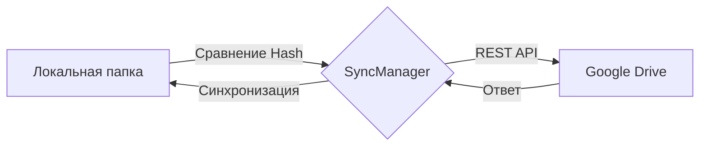

```markdown
# 🚀 CloudSync

<p align="center">
  <a href="https://github.com/qizzi220/1c_project/blob/main/LICENSE">
    
  </a>
  
  
</p>

---

**CloudSync** — это высокопроизводительный кроссплатформенный модуль на C++ для автоматической синхронизации локальных папок с облачными хранилищами (Google Drive). 

Идеально подходит для интеграции в качестве внешнего компонента **1С:Предприятие** или как самостоятельная библиотека для систем автоматизации.

## ✨ Ключевые преимущества

*   **⚡ Экстремальная скорость:** Сравнение файлов происходит за $O(N)$ благодаря хеш-таблицам и модулю `std::filesystem`.
*   **🧠 Умная синхронизация:** Логика разрешения конфликтов реализована по принципу **"Last Write Wins"** (побеждает последняя версия).
*   **🌍 Нативная кроссплатформенность:** Полная поддержка Linux и Windows.
*   **📦 Готовность к 1С:** Архитектура позволяет легко обернуть код во внешний компонент (Native API).

---

## 📊 Процесс работы



---

## 🛠 Зависимости и сборка

Для работы проекта необходимы:

1.  **Библиотека CURL**: Для выполнения сетевых запросов.
    *   *Linux (Ubuntu/Debian):* `sudo apt install libcurl4-openssl-dev`
    *   *Linux (Arch):* `sudo pacman -S curl`
2.  **[nlohmann-json](https://github.com/nlohmann/json)**: (Уже включена в проект в папке `include/nlohmann`).
3.  **CMAKE**: Версия 3.10 или выше.

### Быстрый старт (Сборка)

```bash
# Клонировать репозиторий
git clone https://github.com/qizzi220/1c_project.git
cd 1c_project

# Собрать проект
cmake -B build -DCMAKE_BUILD_TYPE=Release
cmake --build build

# Запустить тест
./build/cloudsync
```

---

## 💻 Пример использования

```cpp
#include "include/CloudSync.h"

int main() {
    // Авторизация через Access Token
    auto api = std::make_shared<CloudApi>("YOUR_ACCESS_TOKEN");
    SyncManager sync(api, "./my_sync_folder");

    // Загрузка конфигурации и запуск
    if (sync.initialize("config.json")) {
        sync.startSync();
    }

    return 0;
}
```

---

## ⚙️ Настройка Google Drive API

1.  Создайте проект в [Google Cloud Console](https://console.cloud.google.com/).
2.  Включите **Google Drive API**.
3.  Получите **OAuth2 Access Token** (через [OAuth Playground](https://developers.google.com/oauthplayground) для тестов). 
4.  ⚠️ **Важно:** Пока проект работает только через `Access Token` (срок жизни 60 мин). Поддержка `Refresh Token` — в планах.

---

## 🗺 План разработки (Roadmap)

| Статус | Задача |
| :---: | :--- |
| ✅ | Реализация базового SyncManager ($O(N)$) |
| ✅ | Поддержка Google Drive API |
| 🏗️ | Добавление поддержки **Yandex Disk** (WebDAV) |
| 🏗️ | Автоматическое обновление через **Refresh Token** |
| 📅 | Продвинутое логирование событий в файл |
| 📅 | Написание Unit-тестов |
| 📅 | Кастомная система обработки ошибок для 1С |

---

## 📄 Лицензия

Этот проект распространяется под лицензией **MIT**. Вы можете свободно использовать, изменять и распространять его даже в коммерческих целях. Подробности в файле [LICENSE](./LICENSE).

---
<p align="center">
  Разработано с ❤️ для C++ разработчиков
</p>
```